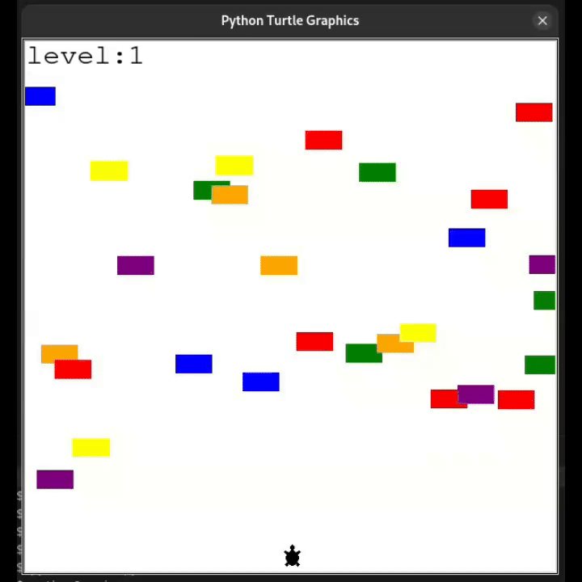

## 🐢 Turtle Crossing Game

A simple road-crossing game built with Python using the `turtle` module.


---

### 🕹️ How to Play

* Use the **Up arrow key** to move the turtle forward.
* Dodge the cars and reach the top of the screen to advance to the next level.
* If the turtle gets hit, the game ends.

---

### ▶️ How to Run

```bash
git clone https://github.com/godfreydekew/turtle_crossing.git
cd turtle_crossing
pip install python3-tk
python3 main.py
```

---


